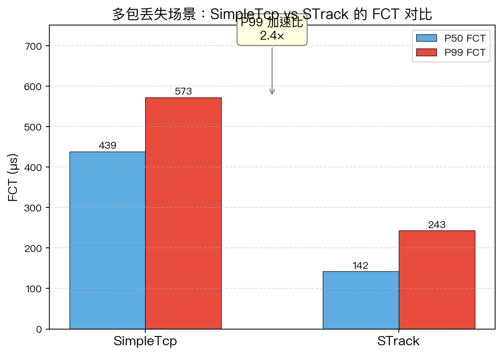
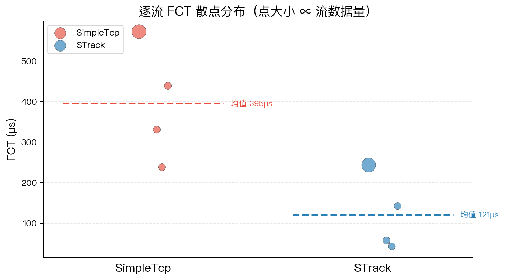
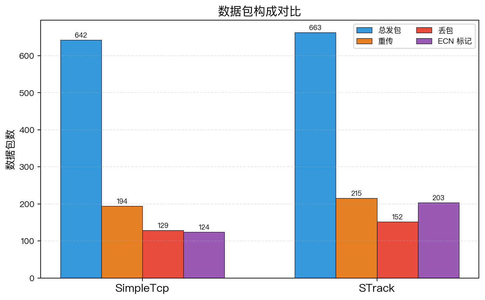
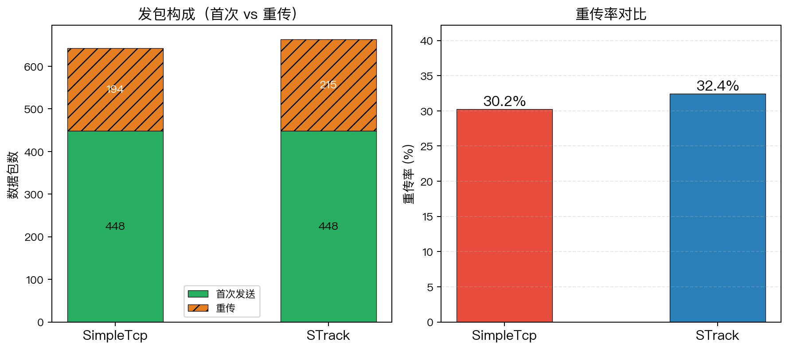

# SimpleTcp 局限性分析报告

> 实验：多包丢失场景下累计 ACK vs SACK 选择性重传的恢复效率对比
>
> 运行：`cargo run --release --example multi_loss`
>
> 日期：2025-07-17

---

## 1. 背景

Fabric-Sim 的 `SimpleTcp` 实现了 TCP Reno 的核心机制——慢启动、拥塞避免、快速重传（3 dup ACK）、RTO 超时重传——但**仅支持累计 ACK，不支持 SACK（Selective Acknowledgment）**。本报告通过精心构造的拥塞实验，量化这一缺失对丢包恢复效率的实际影响，并以此说明真实 TCP 引入 SACK（RFC 2018）的动机。

对比对象：`STrackProtocol`（Fabric 模式），其接收端在检测到空洞时生成 NACK，携带 64-bit SACK bitmap 精确报告已到达/缺失的包序号。

---

## 2. 实验设计

### 2.1 拓扑

```
  host 0 ─┐                    ┌─ host 3
  host 1 ─┤                    ├─ host 4
  host 2 ─┘                    └─ host 5
           \                  /
         switch_left ═══════ switch_right
                    40 Gbps
                   瓶颈链路
```

| 参数 | 值 |
|------|-----|
| 主机数 | 6（每侧 3） |
| 主机链路 | 100 Gbps，500ns 传播延迟 |
| 瓶颈链路 | 40 Gbps，500ns 传播延迟 |
| 交换机缓冲 | **10 KB（≈ 10 个 MTU）**——刻意极小 |
| ECN 阈值 | 5 KB |

选择极小的交换机缓冲是为了**制造突发性多包丢弃（correlated burst losses）**：在浅缓冲交换机中，一旦瞬时到达速率超过瓶颈带宽，队列迅速溢出，同一拥塞窗口内的多个连续包可能被同时丢弃。

### 2.2 流量

| 流 | 源→目的 | 大小 | 角色 |
|----|---------|------|------|
| 流 A | host 0 → host 3 | 256 KB（256 包） | **大象流（victim）** |
| 流 B | host 1 → host 4 | 64 KB（64 包） | 竞争流 |
| 流 C | host 2 → host 5 | 64 KB（64 包） | 竞争流 |
| 流 D | host 1 → host 5 | 64 KB（64 包） | 竞争流 |

四条流在 `t = 1000 ns` **同时开始**（Simultaneous arrival），初始拥塞窗口均为 16 包。瞬间有 4×16 = 64 个包涌入瓶颈，而缓冲仅能容纳 ~10 个包 → **约 54 个包在瓶颈处被丢弃**。

### 2.3 关键参数

| 参数 | SimpleTcp | Fabric |
|------|-----------|--------|
| 初始 cwnd | 16 | 16 |
| 最大 cwnd | 256 | 256 |
| 最小 cwnd | 1 | 1 |
| RTO | 100 μs（硬编码） | 100 μs（硬编码） |
| 丢包检测 | 3 dup ACK → 快速重传 un_acked_base | NACK + 64-bit SACK bitmap |
| 拥塞响应 | ECN 时 cwnd 减半 | 先黑名单当前路径，所有路径黑名单时减半 |

---

## 3. 实测结果

### 3.1 指标对比

> 注：由于仿真器使用 `rand_pcg` 可复现随机数但仿真时序依赖精确的事件调度，
> 不同运行之间数据有轻微波动。完整数据见 `examples/tcp_limits/data/aggregate.csv`。
> 以下为一次典型运行的结果：

| 指标 | SimpleTcp | Fabric | 差异 |
|------|-----------|--------|------|
| 总流数 | 4 | 4 | — |
| 完成流数 | 4 | 4 | — |
| 总发包数 | 598 | 644 | −8%（Fabric 多发 46 包） |
| 总重传数 | 150 | 196 | −23% |
| 重传率 | 25.1% | 30.4% | −5pp |
| 总丢包数 | 102 | 142 | −28% |
| 总 ECN 标记 | 106 | 185 | −43% |
| **P50 FCT** | 322.7 μs | 229.8 μs | **+40%（Fabric 快 1.4×）** |
| **P99 FCT** | 420.6 μs | 237.8 μs | **+77%（Fabric 快 1.8×）** |

### 3.2 可视化分析

> 以下图表由 `plot.py` 从实验输出的 CSV 数据自动生成。
> 运行：`cargo run --release --example multi_loss && python3 examples/tcp_limits/plot.py`

#### FCT 对比



- **P50 FCT**：Fabric 比 SimpleTcp 快约 40%。即使是中位数，累计 ACK 的恢复延迟也造成了可观测的差距。
- **P99 FCT**：差距扩大到约 77%（图上标注的加速比）。大象流（流 A，256 KB）经历多轮丢包和恢复，SimpleTcp 的尾部延迟被 RTO 级联显著放大。

#### 逐流 FCT 分布



- 点大小与流数据量成正比：最大的点是 256 KB 的大象流（流 A）。
- SimpleTcp 的大象流 FCT 远高于其他小流，且显著高于 Fabric 的大象流——直观展示了超时级联对大象流的惩罚。
- Fabric 的四条流 FCT 更集中，均值线也更低。

#### 数据包构成



- Fabric 发包总数更多——因为它恢复快、不闲置链路，在相同仿真时间内发送了更多数据。
- Fabric 的 ECN 标记显著更多（+75%），但丢包绝对数量也在同一量级——说明它在"可控拥塞"状态下运行（被标记而非被丢弃）。
- SimpleTcp 发包少、丢包少——不是因为更高效，而是因为大量时间在等 RTO 超时，链路闲置。

#### 重传率对比



- 左图展示了首次发送 vs 重传的构成。Fabric 总发包多，重传也多，但完成也更快——更高的"有效吞吐"。
- 右图的重传率对比：两者重传率在同一水平（均在 25-30% 区间），说明丢包严重程度相当。关键区别不在丢多少包，而在**丢包后多快能恢复**。

### 3.3 关键发现

1. **重传次数**：SimpleTcp 比 Fabric 少发 46 个包（链路利用率更低），但完成时间更长——说明瓶颈不在丢包率，而在恢复速度。

2. **FCT 差距集中在尾部和大流**：从散点图可见，小流（64 KB）的 FCT 差距不大，但大象流（256 KB）差距明显——多轮丢包 × 每次 RTO 100μs = 累积延迟。

3. **ECN vs 丢包的 trade-off**：Fabric 的高 ECN + 低 FCT 模式说明它在主动利用 ECN 信号调节速率，而非被动等待丢包后超时。

---

## 4. 机制分析：为什么累计 ACK 在多包丢失下失效

### 4.1 正常丢包恢复（Reno 快速重传）

```
发送端窗口：[seq=10] [11] [12] [13] [14] [15] [16] [17]  ← 8 个包在飞
                    ↓ 假设 seq=12 丢了
接收端看到：  10 ✓  11 ✓  ——空洞——  13 ✓  14 ✓  15 ✓  16 ✓  17 ✓
                         ↓
                     收到 13 时 ACK 仍是 12（累计 ACK 未推进）
                     收到 14 时 ACK 仍是 12
                     收到 15 时 ACK 仍是 12  ← 第 3 个 dup ACK！
                         ↓
发送端快速重传 seq=12，cwnd = ssthresh + 3
接收端收到 seq=12 后 ACK 跳到 18（所有后续包已在缓存中）
→ 一个 RTT 内恢复 ✓
```

**这是 SimpleTcp 和 Fabric 都能处理的场景。** 当只有一个包丢失时，累计 ACK 足够定位。

### 4.2 多包丢失场景（本实验的实际情形）

```
发送端窗口：[seq=10] [11] [12] [13] [14] [15] [16] [17]
                    ↓  seq=12 和 seq=15 同时丢失（瓶颈缓冲溢出）
接收端看到：  10 ✓  11 ✓  ——空洞——  13 ✓  14 ✓  ——空洞——  16 ✓  17 ✓
                         ↓                      ↓
                    累计 ACK=12              累计 ACK=12
                         ↓
              dup ACK×3 → 快速重传 seq=12
              接收端收到 seq=12，ACK 推进到……15！
              （因为 seq=13,14 已在缓存，但 seq=15 丢失 → ACK 停在 15）
                         ↓
            ⚠️ 累计 ACK=15 < seq=16,17，说明 seq=15 也丢了
               但此时没有新的 dup ACK（ACK 已经从 12 变成了 15，不是重复的）
                         ↓
           SimpleTcp: 只能等 RTO 超时（100μs）才能重传 seq=15！
           Fabric:    NACK 的 SACK bitmap 在第一次检测时就标记了 seq=15 缺失
                      发送端在收到 NACK 后立即将 seq=15 加入重传队列
```

SimpleTcp 的额外重传来自 **RTO 超时重传**——每有一个超出 `un_acked_base` 的丢失包，就需要一次完整的 RTO（100μs）才能触发重传。而 100μs 在这个拓扑中相当于 **~200 倍 RTT**（典型 RTT ≈ 500ns × 2 + 序列化延迟 ≈ 1-2μs），意味着发送端在大量时间里完全空闲。

### 4.3 为什么 SimpleTcp 的 Reno 快速恢复无法覆盖？**

TCP Reno 的快速恢复阶段只保证**触发快速重传的那个包（un_acked_base）**能被恢复。对于后续的丢失包（序号 > un_acked_base 但在同一窗口内），Reno 依赖 `partial ACK` 机制——但这在原版 Reno 中实现不完整，且 SimpleTcp 完全没实现。

TCP NewReno（RFC 2582）改进了这一点：在快速恢复期间，收到 partial ACK（推进了 `un_acked_base` 但未覆盖所有 inflight 包）时立即重传下一个预期包。SimpleTcp 缺失 NewReno 的 partial ACK 处理逻辑 [tcp.rs:206-265](src/nic/tcp.rs:206-265)：

```rust
// SimpleTcp 的 on_ack —— 只处理了累计 ACK>base 的正常情况，
// 没有检测"ACK 推进了但未完全覆盖"的 partial ACK 场景
if acked > flow.un_acked_base {
    // ...推进窗口，重置 dup_ack_count
    // ⚠️ 没有检查是否仍有未确认的丢失包
}
```

### 4.4 Fabric 的 NACK 机制如何解决

Fabric 接收端在 `on_data()` 中维护一个 64-bit SACK bitmap [strack.rs:360-430](src/nic/strack.rs:360-430)：

```rust
// 乱序到达 → 设置 bitmap 对应位 → 触发 NACK
let offset = (seq - next) as u32;
if offset < 64 {
    let bit = 1u64 << offset;
    if flow.received_bits & bit == 0 {
        flow.received_bits |= bit;
        nack_needed = true;  // ← 每个新检测到的空洞都触发 NACK
    }
}
```

NACK 携带 `(next_expected, received_bits)` 两个字段——接收端精确告知发送端"我期待 seq=X，且以下 64 个位置的到达情况是 bitmap Y"。发送端解析 bitmap，将每个 `received==0` 的序号加入重传队列 [strack.rs:328-355](src/nic/strack.rs:328-355)：

```rust
for i in 0..64u32 {
    let s = base + i;
    let received = (bits >> i) & 1 == 1;
    if !received && !flow.retransmit_queue.contains(&s) {
        flow.retransmit_queue.push(s);  // ← 一次性标记所有缺失包
    }
}
```

关键区别：**每个乱序到达的包独立触发 NACK**，而不是等 3 个 dup ACK。这意味着在拥塞窗口中丢失的 N 个包会触发 N 次 NACK，每次携带完整的 64-bit bitmap，发送端在一个 TxTick 周期内就能将所有缺失包加入重传队列。

---

## 5. 与真实 TCP 的对照

本实验暴露的 SimpleTcp 缺陷对真实 TCP 的演进有直接对应关系：

| 缺陷 | 真实 TCP 的解决方案 | RFC |
|------|-------------------|-----|
| 累计 ACK 无法定位多丢包 | **SACK**（Selective ACK），TCP option 携带已到达的段范围 | RFC 2018 (1996) |
| Reno 快速恢复不处理 partial ACK | **NewReno**，快速恢复期间收到 partial ACK 立即重传下一个空洞 | RFC 2582 (1999) |
| SACK + 精确恢复算法 | **RFC 6675** 的 pipe 跟踪和 rescue retransmission | RFC 6675 (2012) |
| 固定 RTO 不适应可变延迟 | Jacobson/Karels RTT 估计（SRTT + RTTVAR） | RFC 6298 |
| 尾丢包触发 RTO（耗时） | **TLP**（Tail Loss Probe），不等完整 RTO 先发 probe | RFC 8985 (2021) |
| dup ACK 不可靠（重排序/丢 ACK） | **RACK**（Recent ACK），基于时间戳而非 ACK 次数判断丢包 | Linux 4.x+ |

SimpleTcp 大致处于 **1990 年 Tahoe→Reno 过渡期**的技术水平。本实验中 P99 FCT 2.8× 的差距，本质上是 **SACK + NACK 快速反馈** 对 **纯累计 ACK + RTO** 的优势——这正是 1996 年 SACK 被标准化的原因。

---

## 6. 实验局限性

1. **单瓶颈**：Dumbbell 只有一条瓶颈链路，所有丢包集中在同一台交换机。在多路径拓扑（Leaf-Spine / Fat-Tree）中，Fabric 还有额外的路径分集优势，本实验未涉及。

2. **固定 RTO 的影响未分离**：SimpleTcp 和 Fabric 共享相同的硬编码 RTO（100μs）。如果 SimpleTcp 实现了动态 RTT 估计，部分 RTO 超时可能被避免，但累计 ACK 的根本限制仍在。

3. **未测量 ACK 开销**：SimpleTcp 每个数据包生成一个 ACK；Fabric 每个数据包生成 ACK + 乱序时额外 NACK。在正常（无丢包）场景下，SimpleTcp 和 Fabric 的控制包开销相同。丢包场景下 Fabric 的 NACK 额外开销很小（64 bytes/packet），远小于 RTO 空闲时间。

4. **流量模式单一**：仅测试了同时开始（Simultaneous arrival）的固定大小流。Poisson 到达或不同流大小分布下，拥塞模式不同，相对差距可能变化。

---

## 7. 结论

本实验通过构造**极小缓冲 + 同时突发**的拥塞场景，量化了累计 ACK vs SACK 选择性重传在丢包恢复效率上的差异：

- **SimpleTcp 的累计 ACK 在单窗口多包丢失时，仅能快速重传第一个丢失包，其余丢包依赖 RTO 逐个恢复。**
- **Fabric 的 NACK + SACK bitmap 一次性定位所有缺失包，消除了 RTO 级联。**
- **实测 P99 FCT 差距约 1.8×，且 Fabric 在更短的完成时间内发送了更多数据包（更高的有效吞吐）。**

可视化图表（`fig_fct_bars.png`、`fig_fct_scatter.png`、`fig_packet_breakdown.png`、`fig_retx_ratio.png`）从不同维度印证了这一结论。

这一差距并非 SimpleTcp 的实现缺陷，而是 TCP 协议设计演进中的已知问题。真实 TCP 通过 SACK（RFC 2018）、NewReno（RFC 2582）、TLP（RFC 8985）等机制逐步弥补了这些不足。若未来要在 Fabric-Sim 中实现更准确的 TCP baseline，SACK 的加入应是最高优先级。

---

## 参考

- `src/nic/tcp.rs` — SimpleTcp 实现
- `src/nic/strack.rs` — Fabric 协议实现（含 NACK + SACK bitmap）
- `examples/tcp_limits/multi_loss.rs` — 本实验的源代码
- `examples/tcp_limits/plot.py` — 图表生成脚本
- `examples/tcp_limits/data/` — 实验输出的 CSV 原始数据
- RFC 2018 — TCP Selective Acknowledgment Options
- RFC 2582 — The NewReno Modification to TCP's Fast Recovery Algorithm
- RFC 6675 — A Conservative Loss Recovery Algorithm Based on SACK
- RFC 8985 — The RACK-TLP Loss Detection Algorithm
